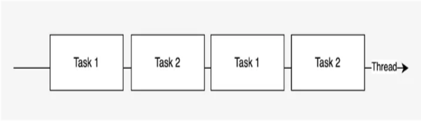

# Concurrency - Parallelism

### Parallelism:


### Concurrency:




# Contexts and Dispatchers

To operate effectively, every coroutine relies on specific components that collectively form the Coroutine Context. 
A coroutine context has elements like a Job that handles the lifecycle, a coroutine name for debugging, an exception handler, and a dispatcher. 
The dispatcher is the element that determines which thread pools will be used for the given coroutine and handles the execution of the coroutine.


## Default Dispatcher
Dispatcher for compute-intensive coroutines that consume CPU resources. By default, the maximum number of threads used by this dispatcher is equal to the number of CPU cores, but is at least two.

```kotlin
launch(Dispatchers.Default) { ... }
```

## IO Dispatcher 
For IO-intensive operations like database calls, network calls, disk operations. It defaults to the limit of 64 threads or the number of cores (whichever is larger).

```kotlin
launch(Dispatchers.IO) { ... }
```

## Unconfined Dispatcher
A coroutine dispatcher that is not confined to any specific thread. **The Unconfined dispatcher should not normally be used in code.**

```kotlin
launch(Dispatchers.Unconfined) { ... }
```

## Main Dispatcher
A coroutine dispatcher that is confined to the Main thread operating with UI objects. Usually such dispatchers are single-threaded.

```kotlin
launch(Dispatchers.Main) { ... }
```
