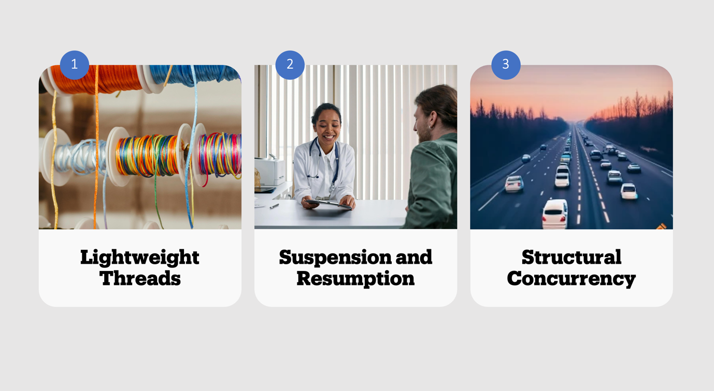
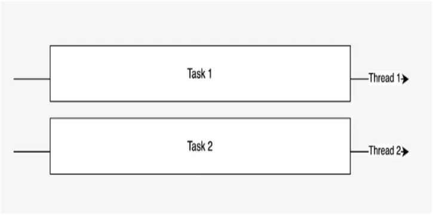

# Coroutine Builders


### runBlocking
runBlocking is a coroutine builder that bridges the non-coroutine world with coroutine world. (Be careful when using it, check this [link](https://techlab.bol.com/en/blog/coroutine-gotchas-bridging-the-gap-between-coroutine-and-non-coroutine-worlds/) out)

```kotlin
  runBlocking {
      println("Hello, World!")
  }
```

### launch
Creates a coroutine and returns a `Job`. It's good to use with operations where you do not need to return the result.
```kotlin
  runBlocking {
    val job = launch {
        number1 + number2
    }

    val resultOfJob = job.join() //Unit
  }
```

### async
Creates a coroutine and returns `Deferred`. It is good to use when you need the result of the operation that the coroutine is doing.
```kotlin
  runBlocking {
    val deferred = async {
        number1 + number2
    }

    val resultOfAsync = deferred.await()  //Int
  }
```

### coroutineScope
This builder creates a coroutine scope and does not complete until all launched children complete. A `coroutineScope` builder can be used inside any suspending function to perform multiple concurrent operations.
Below example shows a suspending function that uses a `coroutineScope`
```kotlin
suspend fun sum(number1: Int, number2: Int) = coroutineScope {
    val deferred = async {
        number1 + number2
    }

    deferred.await()
}
```


# Contexts and Dispatchers

To operate effectively, every coroutine relies on specific components that collectively form the Coroutine Context.
A coroutine context has elements like a Job that handles the lifecycle, a coroutine name for debugging, an exception handler, and a dispatcher.
The dispatcher is the element that determines which thread pools will be used for the given coroutine and handles the execution of the coroutine.

## Default Dispatcher
Dispatcher for compute-intensive coroutines that consume CPU resources. By default, the maximum number of threads used by this dispatcher is equal to the number of CPU cores, but is at least two.


```kotlin
launch(Dispatchers.Default) { ... }
```

## IO Dispatcher
For IO-intensive operations like database calls, network calls, disk operations. It defaults to the limit of 64 threads or the number of cores (whichever is larger).



```kotlin
launch(Dispatchers.IO) { ... }
```

## Unconfined Dispatcher
A coroutine dispatcher that is not confined to any specific thread. **The Unconfined dispatcher should not normally be used in code.**

```kotlin
launch(Dispatchers.Unconfined) { ... }
```

## Main Dispatcher
A coroutine dispatcher that is confined to the Main thread operating with UI objects. Usually such dispatchers are single-threaded.

```kotlin
launch(Dispatchers.Main) { ... }
```


# Cancellation


**CancellationException:**
A cancelled coroutine throws CancellationException in suspension points. This exception is used internally to stop the coroutine's execution.

**Cancellation Propagation:**
When a parent coroutine is cancelled, all its child coroutines are also cancelled. This ensures that no leftover work is being done by the child coroutines.

How does cancelling work?

With threads:

```kotlin
val thread = thread {
    //do something
} 
thread.interrupt()
```

With coroutines:

```kotlin
val job = launch {
    //do something
}
job.cancel()
```

Two flavors of cancelling jobs:

```kotlin
job.cancel()
job.cancelAndJoin()
```


<!-- Image from: https://kotlinlang.org/api/kotlinx.coroutines/kotlinx-coroutines-core/kotlinx.coroutines/-job/  -->


# Exception

Exceptions will be propagated to parent scope and parent scope will send a cancellation signal to all the other children.

```kotlin
coroutineScope {
    launch {
        delay(2000)
        println("Will I be printed?")
    }

    launch {
        throw Exception("I want to break free!")
    }
}
```

## SupervisorScope

Instead of coroutineScope, we can use supervisorScope for scoped concurrency. It propagates the cancellation in one direction only and cancels all its children only if it failed itself. It also waits for all children before completion just like coroutineScope does.

```kotlin
supervisorScope {
    launch {
        delay(2000)
        println("Will I be printed?")
    }

    launch {
        throw Exception("I want to break free!")
    }
}
```


